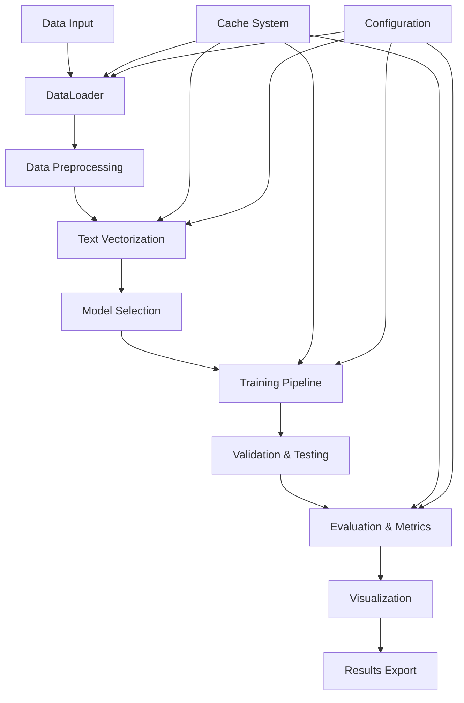

# Pipeline Logic Documentation - Comprehensive Machine Learning Platform

## Tổng Quan Pipeline

Dự án **Comprehensive Machine Learning Platform** sử dụng một pipeline logic phức tạp và tinh vi để xử lý dữ liệu từ đầu vào đến kết quả cuối cùng. Pipeline được thiết kế với kiến trúc modular, hỗ trợ nhiều loại dữ liệu và mô hình ML khác nhau.

---

## Kiến Trúc Pipeline Tổng Thể



---

## 1. Data Input & Loading Pipeline

### 1.1 Data Sources
```python
# Multiple data sources supported
DATA_SOURCES = {
    "heart_disease": "Heart_disease_cleveland_new.csv",
    "spam_detection": "2cls_spam_text_cls.csv", 
    "large_text": "20250822-004129_sample-300_000Samples.csv",
    "arxiv_backup": "arxiv_dataset_backup.csv"
}
```

### 1.2 DataLoader Logic (`data_loader.py`)

```python
class DataLoader:
    def __init__(self):
        self.dataset = None
        self.samples = []
        self.preprocessed_samples = []
        self.label_to_id = {}
        self.id_to_label = {}
        self.available_categories = []
        self.selected_categories = []
        self.category_stats = {}
        self.is_multi_input = False
    
    def load_dataset(self):
        """Dynamic dataset loading with auto-detection"""
        # 1. Check cache first
        # 2. Load from HuggingFace datasets
        # 3. Fallback to CSV files
        # 4. Auto-detect data types and categories
    
    def discover_categories(self):
        """Auto-discover available categories"""
        # Dynamic category detection
        # Statistical analysis of categories
        # Recommendation system
    
    def select_samples(self, max_samples):
        """Intelligent sampling strategy"""
        # Stratified sampling
        # Category balancing
        # Memory optimization
```

### 1.3 Data Preprocessing Pipeline

```python
def preprocess_samples(self):
    """Comprehensive preprocessing pipeline"""
    # 1. Text cleaning and normalization
    # 2. Missing value handling
    # 3. Outlier detection and treatment
    # 4. Feature type detection (numeric/text)
    # 5. Encoding strategies
    # 6. Scaling and normalization
```

**Preprocessing Steps:**
1. **Text Cleaning**: Remove special characters, normalize whitespace
2. **Missing Value Handling**: 
   - Numeric: mean/median/mode imputation
   - Text: mode imputation or removal
3. **Outlier Detection**: IQR, Z-score, Isolation Forest
4. **Feature Engineering**: Auto-detection of feature types
5. **Encoding**: Label encoding, One-hot encoding, Target encoding

---

## 2. Text Vectorization Pipeline

### 2.1 TextVectorizer Architecture (`text_encoders.py`)

```python
class TextVectorizer:
    def __init__(self):
        self.bow_vectorizer = None
        self.tfidf_vectorizer = None
        self.embedding_model = None
        self.svd_bow = None
        self.svd_tfidf = None
    
    def fit_transform_bow_svd(self, texts):
        """Bag of Words with SVD optimization"""
        # 1. CountVectorizer with vocabulary limits
        # 2. SVD dimensionality reduction
        # 3. Memory optimization for large datasets
    
    def fit_transform_tfidf_svd(self, texts):
        """TF-IDF with SVD optimization"""
        # 1. TfidfVectorizer with sublinear scaling
        # 2. SVD dimensionality reduction
        # 3. Sparse matrix optimization
    
    def transform_embeddings(self, texts):
        """Sentence transformer embeddings"""
        # 1. Pre-trained model loading
        # 2. GPU acceleration if available
        # 3. Batch processing for efficiency
```

### 2.2 Vectorization Strategies

**A. Bag of Words (BoW)**
```python
# Configuration
MAX_VOCABULARY_SIZE = 30000
BOW_TFIDF_SVD_COMPONENTS = 400
BOW_TFIDF_SVD_THRESHOLD = 200

# Pipeline
texts → CountVectorizer → SVD → Dense Matrix
```

**B. TF-IDF**
```python
# Configuration  
MAX_VOCABULARY_SIZE = 30000
BOW_TFIDF_SVD_COMPONENTS = 400

# Pipeline
texts → TfidfVectorizer → SVD → Dense Matrix
```

**C. Word Embeddings**
```python
# Configuration
EMBEDDING_MODEL_NAME = 'sentence-transformers/allenai-specter'
EMBEDDING_NORMALIZE = True
EMBEDDING_DEVICE = 'auto'

# Pipeline
texts → SentenceTransformer → GPU Processing → Normalized Embeddings
```

---

## 3. Model Training Pipeline

### 3.1 Model Architecture (`models/`)

```python
# Base Model Architecture
class BaseModel(ABC):
    def __init__(self, **kwargs):
        self.model = None
        self.is_fitted = False
        self.model_params = kwargs
        self.training_history = []
        self.validation_metrics = {}
    
    @abstractmethod
    def fit(self, X, y):
        """Fit model to training data"""
        pass
    
    @abstractmethod
    def predict(self, X):
        """Make predictions"""
        pass
    
    def validate(self, X_val, y_val):
        """Cross-validation and metrics"""
        pass
```

### 3.2 Model Registry System

```python
class ModelRegistry:
    def __init__(self):
        self.models = {}
        self.model_configs = {}
    
    def register_model(self, name, model_class, config):
        """Register model with configuration"""
        self.models[name] = model_class
        self.model_configs[name] = config
    
    def get_model(self, name, **kwargs):
        """Factory method to create model instances"""
        return self.models[name](**kwargs)
```

### 3.3 Training Pipeline Logic

```python
class TrainingPipeline:
    def __init__(self):
        self.models = {}
        self.results = {}
        self.cache_manager = CacheManager()
    
    def train_model(self, model_name, X_train, y_train, X_val, y_val):
        """Comprehensive training pipeline"""
        # 1. Model instantiation
        # 2. Hyperparameter optimization (Optuna)
        # 3. Cross-validation
        # 4. Training with progress tracking
        # 5. Validation and metrics calculation
        # 6. Model caching
        # 7. Results storage
```

**Training Steps:**
1. **Model Instantiation**: Factory pattern creation
2. **Hyperparameter Optimization**: Optuna integration
3. **Cross-Validation**: Stratified K-fold
4. **Training**: GPU acceleration if available
5. **Validation**: Performance metrics calculation
6. **Caching**: Model and results persistence
7. **Results Storage**: Comprehensive metrics

---

## 4. Validation & Testing Pipeline

### 4.1 ValidationManager (`models/utils/validation_manager.py`)

```python
class ValidationManager:
    def __init__(self, cv_folds=5, validation_size=0.2, test_size=0.2):
        self.cv_folds = cv_folds
        self.validation_size = validation_size
        self.test_size = test_size
        self.random_state = 42
    
    def split_data(self, X, y):
        """3-way data splitting"""
        # Train/Validation/Test split
        # Stratified sampling
        # Reproducible splits
    
    def cross_validate(self, model, X, y):
        """Cross-validation with metrics"""
        # Stratified K-fold
        # Multiple metrics calculation
        # Overfitting detection
```

### 4.2 Comprehensive Evaluation (`comprehensive_evaluation.py`)

```python
class ComprehensiveEvaluator:
    def __init__(self):
        self.embedding_methods = ['bow', 'tfidf', 'embeddings']
        self.model_types = ['classification', 'clustering', 'ensemble']
        self.results = {}
    
    def evaluate_all_combinations(self, data_loader):
        """Evaluate all embedding-model combinations"""
        # 1. Generate all combinations
        # 2. Train and validate each combination
        # 3. Calculate comprehensive metrics
        # 4. Detect overfitting/underfitting
        # 5. Generate comparison reports
```

**Evaluation Metrics:**
- **Classification**: Accuracy, Precision, Recall, F1-Score, AUC-ROC
- **Clustering**: Silhouette Score, Adjusted Rand Index, Homogeneity
- **Cross-Validation**: Mean, Std, Confidence Intervals
- **Overfitting Detection**: Train vs Validation performance

---

## 5. Caching System Pipeline

### 5.1 Cache Architecture

```python
class CacheManager:
    def __init__(self):
        self.cache_dir = "./cache"
        self.model_cache = ModelCache()
        self.training_cache = TrainingCache()
        self.shap_cache = SHAPCache()
        self.confusion_cache = ConfusionCache()
    
    def get_cache_key(self, data_hash, model_name, params):
        """Generate unique cache keys"""
        # Hash-based cache keys
        # Parameter fingerprinting
        # Data fingerprinting
```

### 5.2 Cache Hierarchy

```
cache/
├── models/                    # Trained model cache
│   ├── {model_name}/
│   │   ├── {data_hash}/
│   │   │   ├── model.joblib
│   │   │   ├── metrics.json
│   │   │   └── config.json
│
├── training_results/          # Training results cache
│   ├── {session_hash}/
│   │   ├── results.json
│   │   ├── metrics.json
│   │   └── plots/
│
├── shap/                      # SHAP explanations cache
│   ├── {model_name}/
│   │   ├── {data_hash}/
│   │   │   ├── shap_values.npy
│   │   │   └── explanations.json
│
└── confusion_matrices/         # Confusion matrix cache
    ├── {model_name}_{dataset}_{scaler}.png
```

### 5.3 Cache Logic

```python
def cache_model(self, model, data_hash, model_name, params):
    """Cache trained model with metadata"""
    # 1. Generate cache key
    # 2. Serialize model
    # 3. Store metadata
    # 4. Update cache index

def load_cached_model(self, data_hash, model_name, params):
    """Load cached model if available"""
    # 1. Check cache existence
    # 2. Validate cache integrity
    # 3. Load model and metadata
    # 4. Return cached model or None
```

---

## 6. Streamlit Wizard Pipeline

### 6.1 Wizard Architecture (`wizard_ui/`)

```python
class WizardManager:
    def __init__(self):
        self.current_step = 1
        self.total_steps = 7
        self.step_status = {}
        self.session_data = {}
    
    def execute_step(self, step_number):
        """Execute specific wizard step"""
        # Step-specific logic
        # Validation
        # Progress tracking
        # Error handling
```

### 6.2 7-Step Wizard Pipeline

**Step 1: Dataset Selection & Upload**
```python
def step1_dataset_selection():
    # 1. File upload interface
    # 2. Dataset preview
    # 3. Data type detection
    # 4. Category discovery
    # 5. Sample size selection
```

**Step 2: Data Preprocessing & Sampling**
```python
def step2_preprocessing():
    # 1. Preprocessing configuration
    # 2. Sampling strategy selection
    # 3. Feature engineering options
    # 4. Missing value handling
    # 5. Outlier treatment
```

**Step 3: Model Selection & Configuration**
```python
def step3_model_selection():
    # 1. Model type selection
    # 2. Hyperparameter configuration
    # 3. Ensemble options
    # 4. Optimization settings
    # 5. Cross-validation setup
```

**Step 4: Training & Validation**
```python
def step4_training():
    # 1. Training execution
    # 2. Progress monitoring
    # 3. Real-time metrics
    # 4. Error handling
    # 5. Early stopping
```

**Step 5: Evaluation & Metrics**
```python
def step5_evaluation():
    # 1. Performance metrics calculation
    # 2. Confusion matrix generation
    # 3. ROC curves
    # 4. Feature importance
    # 5. Model comparison
```

**Step 6: Visualization & Analysis**
```python
def step6_visualization():
    # 1. Interactive plots
    # 2. SHAP explanations
    # 3. Model interpretability
    # 4. Performance analysis
    # 5. Error analysis
```

**Step 7: Export & Save Results**
```python
def step7_export():
    # 1. Results export
    # 2. Model saving
    # 3. Report generation
    # 4. Session backup
    # 5. Download options
```

---

## 7. GPU Acceleration Pipeline

### 7.1 GPU Detection & Configuration

```python
class GPUConfigManager:
    def __init__(self):
        self.gpu_available = False
        self.cuda_version = None
        self.gpu_memory = None
        self.device_policy = "gpu_first"
    
    def detect_gpu_capabilities(self):
        """Detect and configure GPU capabilities"""
        # 1. CUDA availability check
        # 2. GPU memory detection
        # 3. cuDNN compatibility
        # 4. RAPIDS cuML detection
        # 5. Device configuration
```

### 7.2 GPU Optimization Pipeline

```python
def optimize_for_gpu(self, data, model_type):
    """GPU optimization strategies"""
    # 1. Data type optimization (float32)
    # 2. Batch size optimization
    # 3. Memory management
    # 4. Sparse matrix handling
    # 5. Model-specific optimizations
```

**GPU Optimization Strategies:**
- **Data Processing**: cuDF, cuPy for data manipulation
- **Model Training**: PyTorch GPU, cuML for ML algorithms
- **Memory Management**: Efficient memory allocation
- **Batch Processing**: Optimal batch sizes
- **Sparse Matrices**: GPU-optimized sparse operations

---

## 8. Error Handling & Recovery Pipeline

### 8.1 Error Handling Strategy

```python
class ErrorHandler:
    def __init__(self):
        self.error_log = []
        self.recovery_strategies = {}
    
    def handle_error(self, error_type, context):
        """Comprehensive error handling"""
        # 1. Error classification
        # 2. Context analysis
        # 3. Recovery strategy selection
        # 4. Fallback mechanisms
        # 5. User notification
```

### 8.2 Recovery Mechanisms

**A. Data Loading Errors**
```python
# Fallback strategies
1. Cache loading → CSV loading → Sample generation
2. Memory optimization → Chunked processing
3. Format conversion → Auto-detection
```

**B. Model Training Errors**
```python
# Recovery strategies
1. Parameter adjustment → Simplified model
2. Data reduction → Subset training
3. CPU fallback → GPU error recovery
4. Cache utilization → Skip training
```

**C. Memory Errors**
```python
# Recovery strategies
1. Garbage collection → Memory cleanup
2. Batch size reduction → Smaller batches
3. Sparse matrices → Memory optimization
4. Chunked processing → Sequential processing
```

---

## 9. Performance Optimization Pipeline

### 9.1 Memory Management

```python
class MemoryManager:
    def __init__(self):
        self.memory_thresholds = {}
        self.optimization_strategies = {}
    
    def optimize_memory_usage(self, data_size, available_memory):
        """Dynamic memory optimization"""
        # 1. Memory usage estimation
        # 2. Strategy selection
        # 3. Data chunking
        # 4. Sparse matrix conversion
        # 5. Garbage collection
```

### 9.2 Performance Monitoring

```python
class PerformanceMonitor:
    def __init__(self):
        self.metrics = {}
        self.bottlenecks = []
    
    def monitor_pipeline_performance(self):
        """Real-time performance monitoring"""
        # 1. Execution time tracking
        # 2. Memory usage monitoring
        # 3. GPU utilization tracking
        # 4. Bottleneck identification
        # 5. Optimization suggestions
```

---

## 10. Results & Export Pipeline

### 10.1 Results Aggregation

```python
class ResultsAggregator:
    def __init__(self):
        self.results = {}
        self.metrics = {}
        self.visualizations = {}
    
    def aggregate_results(self, training_results):
        """Comprehensive results aggregation"""
        # 1. Metrics consolidation
        # 2. Model comparison
        # 3. Statistical analysis
        # 4. Visualization generation
        # 5. Report creation
```

### 10.2 Export Formats

**A. Model Export**
```python
# Export formats
1. joblib files → Model serialization
2. pickle files → Python objects
3. ONNX format → Cross-platform models
4. JSON configs → Model configurations
```

**B. Results Export**
```python
# Export formats
1. CSV files → Tabular results
2. JSON files → Structured data
3. PDF reports → Comprehensive reports
4. PNG images → Visualizations
5. HTML reports → Interactive reports
```

---

## Pipeline Flow Summary

### 🔄 **Complete Pipeline Flow**

```
1. Data Input → DataLoader → Preprocessing → Vectorization
2. Model Selection → Training → Validation → Evaluation
3. Visualization → Export → Caching → Results
4. Error Handling → Recovery → Optimization → Monitoring
```

### 📊 **Key Pipeline Characteristics**

- **Modular Design**: Each component is independent and reusable
- **Caching Strategy**: Intelligent caching at multiple levels
- **Error Recovery**: Comprehensive error handling and recovery
- **Performance Optimization**: GPU acceleration and memory management
- **Scalability**: Handles datasets from 1K to 300K+ samples
- **Flexibility**: Supports multiple data types and model types
- **User Experience**: Interactive wizard with real-time feedback

### 🎯 **Pipeline Benefits**

- ✅ **Efficiency**: Optimized for speed and memory usage
- ✅ **Reliability**: Robust error handling and recovery
- ✅ **Scalability**: Handles various dataset sizes
- ✅ **Flexibility**: Supports multiple ML paradigms
- ✅ **User-Friendly**: Interactive and intuitive interface
- ✅ **Professional**: Production-ready architecture

---

*Pipeline Logic Documentation - Comprehensive Machine Learning Platform*
*Cập nhật: 2025-01-27*
