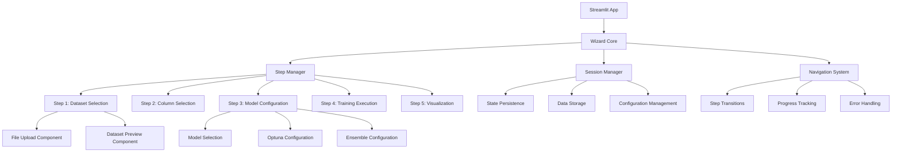

# Wizard UI Architecture Guide - Comprehensive Machine Learning Platform

## Tổng Quan Wizard UI Architecture

Dự án **Comprehensive Machine Learning Platform** sử dụng một kiến trúc Wizard UI tinh vi được thiết kế với Streamlit, cung cấp một giao diện người dùng trực quan và tương tác cho toàn bộ machine learning pipeline. Kiến trúc này được thiết kế modular với session management, component system, và comprehensive error handling.

---

## 1. Wizard UI Architecture Overview

### 1.1 Kiến Trúc Tổng Thể



### 1.2 Core Components

```python
# Wizard UI Core Components
WIZARD_COMPONENTS = {
    "core": "wizard_ui/core.py",
    "session_manager": "wizard_ui/session_manager.py", 
    "navigation": "wizard_ui/navigation.py",
    "validation": "wizard_ui/validation.py",
    "components": {
        "dataset_preview": "wizard_ui/components/dataset_preview.py",
        "file_upload": "wizard_ui/components/file_upload.py"
    },
    "steps": {
        "step1": "wizard_ui/steps/step1_dataset.py",
        "step3": "wizard_ui/steps/step3_optuna_stacking.py",
        "step5": "wizard_ui/steps/step5_shap_visualization.py"
    }
}
```

---

## 2. Wizard Core System (`wizard_ui/core.py`)

### 2.1 Core Wizard Management

```python
class WizardCore:
    """Main controller for the wizard interface"""
    
    def __init__(self):
        self.session_manager = SessionManager()
        self.navigation = NavigationSystem()
        self.step_manager = StepManager()
        self.error_handler = ErrorHandler()
        
    def initialize_wizard(self):
        """Initialize wizard with default state"""
        self.session_manager.initialize_session()
        self.navigation.setup_navigation()
        self.step_manager.initialize_steps()
```

### 2.2 Step Status Management

```python
class StepStatus(Enum):
    """Enumeration for step completion status"""
    PENDING = "pending"
    IN_PROGRESS = "in_progress"
    COMPLETED = "completed"
    BLOCKED = "blocked"
    ERROR = "error"

class StepManager:
    """Manages wizard steps and transitions"""
    
    def __init__(self):
        self.current_step = 1
        self.step_status = {i: StepStatus.PENDING for i in range(1, 6)}
        self.step_data = {}
        
    def get_current_step(self) -> int:
        """Get current active step"""
        return self.current_step
        
    def can_proceed_to_step(self, step: int) -> bool:
        """Check if user can proceed to specified step"""
        # Check if all previous steps are completed
        for i in range(1, step):
            if self.step_status[i] != StepStatus.COMPLETED:
                return False
        return True
        
    def complete_step(self, step: int, data: Dict[str, Any]):
        """Mark step as completed and store data"""
        self.step_status[step] = StepStatus.COMPLETED
        self.step_data[step] = data
```

### 2.3 Error Handling System

```python
class ErrorHandler:
    """Comprehensive error handling for wizard"""
    
    def __init__(self):
        self.error_log = []
        self.recovery_strategies = {}
        
    def handle_error(self, error: Exception, context: str):
        """Handle errors with context and recovery"""
        error_info = {
            'timestamp': datetime.now(),
            'error_type': type(error).__name__,
            'error_message': str(error),
            'context': context,
            'step': self.get_current_step()
        }
        
        self.error_log.append(error_info)
        
        # Attempt recovery
        if context in self.recovery_strategies:
            return self.recovery_strategies[context](error)
        else:
            return self.default_recovery(error)
            
    def default_recovery(self, error: Exception):
        """Default error recovery strategy"""
        st.error(f"An error occurred: {str(error)}")
        st.info("Please try again or contact support if the problem persists.")
        return False
```

---

## 3. Session Management System (`wizard_ui/session_manager.py`)

### 3.1 Session State Management

```python
class SessionManager:
    """Manages Streamlit session state for the wizard interface"""
    
    def __init__(self):
        self.session_key = "wizard_session"
        self.backup_file = "wizard_ui/session_backup.json"
        
    def initialize_session(self):
        """Initialize session with default values"""
        if self.session_key not in st.session_state:
            st.session_state[self.session_key] = {
                'current_step': 1,
                'step_data': {},
                'step_status': {},
                'configuration': {},
                'errors': [],
                'last_updated': datetime.now().isoformat()
            }
            
    def save_step_data(self, step: int, data: Dict[str, Any]):
        """Save data for specific step"""
        session = st.session_state[self.session_key]
        session['step_data'][step] = data
        session['last_updated'] = datetime.now().isoformat()
        
        # Auto-save to backup file
        self.save_to_backup()
        
    def get_step_data(self, step: int) -> Dict[str, Any]:
        """Get data for specific step"""
        session = st.session_state[self.session_key]
        return session['step_data'].get(step, {})
        
    def clear_session(self):
        """Clear all session data"""
        if self.session_key in st.session_state:
            del st.session_state[self.session_key]
        self.initialize_session()
```

### 3.2 Data Persistence

```python
def save_to_backup(self):
    """Save session to backup file"""
    try:
        session_data = st.session_state[self.session_key]
        
        # Remove non-serializable objects
        clean_data = self.clean_session_data(session_data)
        
        with open(self.backup_file, 'w') as f:
            json.dump(clean_data, f, indent=2)
            
    except Exception as e:
        logger.warning(f"Failed to save session backup: {e}")
        
def load_from_backup(self) -> bool:
    """Load session from backup file"""
    try:
        if os.path.exists(self.backup_file):
            with open(self.backup_file, 'r') as f:
                backup_data = json.load(f)
                
            # Restore session state
            st.session_state[self.session_key] = backup_data
            return True
            
    except Exception as e:
        logger.warning(f"Failed to load session backup: {e}")
        
    return False
```

### 3.3 Configuration Management

```python
def save_configuration(self, config: Dict[str, Any]):
    """Save wizard configuration"""
    session = st.session_state[self.session_key]
    session['configuration'].update(config)
    session['last_updated'] = datetime.now().isoformat()
    
def get_configuration(self, key: str = None) -> Any:
    """Get configuration value"""
    session = st.session_state[self.session_key]
    config = session.get('configuration', {})
    
    if key:
        return config.get(key)
    return config
```

---

## 4. Navigation System (`wizard_ui/navigation.py`)

### 4.1 Navigation Controller

```python
class NavigationSystem:
    """Handles wizard navigation and step transitions"""
    
    def __init__(self):
        self.steps = {
            1: "Dataset Selection",
            2: "Column Selection", 
            3: "Model Configuration",
            4: "Training Execution",
            5: "Visualization & Analysis"
        }
        self.current_step = 1
        
    def render_navigation_sidebar(self):
        """Render navigation sidebar"""
        st.sidebar.title("🧙‍♂️ ML Wizard")
        st.sidebar.markdown("---")
        
        for step_num, step_name in self.steps.items():
            status = self.get_step_status(step_num)
            icon = self.get_step_icon(status)
            
            if step_num == self.current_step:
                st.sidebar.markdown(f"**{icon} {step_name}** (Current)")
            elif status == "completed":
                st.sidebar.markdown(f"{icon} {step_name} ✅")
            elif status == "blocked":
                st.sidebar.markdown(f"{icon} {step_name} ⏸️")
            else:
                st.sidebar.markdown(f"{icon} {step_name}")
                
    def get_step_status(self, step: int) -> str:
        """Get status of specific step"""
        session = st.session_state.get('wizard_session', {})
        return session.get('step_status', {}).get(step, 'pending')
        
    def get_step_icon(self, status: str) -> str:
        """Get icon for step status"""
        icons = {
            'pending': '⏳',
            'in_progress': '🔄',
            'completed': '✅',
            'blocked': '⏸️',
            'error': '❌'
        }
        return icons.get(status, '⏳')
```

### 4.2 Step Transitions

```python
def handle_step_transition(self, target_step: int):
    """Handle transition to target step"""
    
    # Validate transition
    if not self.can_transition_to(target_step):
        st.error("Cannot proceed to this step. Please complete previous steps first.")
        return False
        
    # Update current step
    self.current_step = target_step
    
    # Update session state
    session = st.session_state['wizard_session']
    session['current_step'] = target_step
    
    # Clear any previous errors
    session['errors'] = []
    
    return True
    
def can_transition_to(self, target_step: int) -> bool:
    """Check if transition to target step is allowed"""
    
    # Can always go back to previous steps
    if target_step < self.current_step:
        return True
        
    # Can only proceed if all previous steps are completed
    for step in range(1, target_step):
        if not self.is_step_completed(step):
            return False
            
    return True
```

---

## 5. Component System

### 5.1 File Upload Component (`wizard_ui/components/file_upload.py`)

```python
class FileUploadComponent:
    """Reusable file upload component"""
    
    def __init__(self):
        self.supported_formats = ['.csv', '.xlsx', '.json']
        self.max_file_size = 100 * 1024 * 1024  # 100MB
        
    def render_file_upload(self):
        """Render file upload interface"""
        
        st.subheader("📁 Upload Dataset")
        
        # File uploader
        uploaded_file = st.file_uploader(
            "Choose a file",
            type=self.supported_formats,
            help=f"Supported formats: {', '.join(self.supported_formats)}"
        )
        
        if uploaded_file:
            # Validate file
            if not self.validate_file(uploaded_file):
                return None
                
            # Process file
            return self.process_uploaded_file(uploaded_file)
            
        return None
        
    def validate_file(self, file) -> bool:
        """Validate uploaded file"""
        
        # Check file size
        if file.size > self.max_file_size:
            st.error(f"File size exceeds limit of {self.max_file_size // (1024*1024)}MB")
            return False
            
        # Check file format
        file_extension = os.path.splitext(file.name)[1].lower()
        if file_extension not in self.supported_formats:
            st.error(f"Unsupported file format: {file_extension}")
            return False
            
        return True
        
    def process_uploaded_file(self, file):
        """Process uploaded file and return DataFrame"""
        
        try:
            file_extension = os.path.splitext(file.name)[1].lower()
            
            if file_extension == '.csv':
                df = pd.read_csv(file)
            elif file_extension == '.xlsx':
                df = pd.read_excel(file)
            elif file_extension == '.json':
                df = pd.read_json(file)
            else:
                raise ValueError(f"Unsupported format: {file_extension}")
                
            # Basic validation
            if df.empty:
                st.error("Uploaded file is empty")
                return None
                
            # Store file info
            file_info = {
                'name': file.name,
                'size': file.size,
                'shape': df.shape,
                'columns': df.columns.tolist(),
                'dataframe': df
            }
            
            return file_info
            
        except Exception as e:
            st.error(f"Error processing file: {str(e)}")
            return None
```

### 5.2 Dataset Preview Component (`wizard_ui/components/dataset_preview.py`)

```python
class DatasetPreviewComponent:
    """Dataset preview and analysis component"""
    
    def render_dataset_preview(self, df: pd.DataFrame):
        """Render comprehensive dataset preview"""
        
        st.subheader("📊 Dataset Preview")
        
        # Basic info
        col1, col2, col3 = st.columns(3)
        
        with col1:
            st.metric("Rows", f"{df.shape[0]:,}")
        with col2:
            st.metric("Columns", f"{df.shape[1]:,}")
        with col3:
            st.metric("Memory Usage", f"{df.memory_usage(deep=True).sum() / 1024**2:.1f} MB")
        
        # Data preview
        st.subheader("Data Preview")
        
        # Show first few rows
        st.dataframe(df.head(10), use_container_width=True)
        
        # Data types
        st.subheader("Data Types")
        dtype_df = pd.DataFrame({
            'Column': df.columns,
            'Type': df.dtypes,
            'Non-Null Count': df.count(),
            'Null Count': df.isnull().sum()
        })
        st.dataframe(dtype_df, use_container_width=True)
        
        # Statistical summary
        st.subheader("Statistical Summary")
        st.dataframe(df.describe(), use_container_width=True)
        
        # Missing values analysis
        if df.isnull().sum().sum() > 0:
            st.subheader("Missing Values Analysis")
            missing_df = pd.DataFrame({
                'Column': df.columns,
                'Missing Count': df.isnull().sum(),
                'Missing Percentage': (df.isnull().sum() / len(df)) * 100
            }).sort_values('Missing Count', ascending=False)
            
            st.dataframe(missing_df, use_container_width=True)
            
            # Missing values visualization
            fig, ax = plt.subplots(figsize=(10, 6))
            missing_df[missing_df['Missing Count'] > 0].set_index('Column')['Missing Count'].plot(kind='bar', ax=ax)
            ax.set_title('Missing Values by Column')
            ax.set_ylabel('Missing Count')
            plt.xticks(rotation=45)
            st.pyplot(fig)
```

---

## 6. Step Implementations

### 6.1 Step 1: Dataset Selection (`wizard_ui/steps/step1_dataset.py`)

```python
class DatasetSelectionStep:
    """Step 1: Dataset Selection and Upload"""
    
    def __init__(self):
        self.file_upload = FileUploadComponent()
        self.dataset_preview = DatasetPreviewComponent()
        
    def render(self):
        """Render Step 1 interface"""
        
        st.title("📁 Step 1: Dataset Selection")
        
        # File upload section
        uploaded_data = self.file_upload.render_file_upload()
        
        if uploaded_data:
            # Dataset preview
            self.dataset_preview.render_dataset_preview(uploaded_data['dataframe'])
            
            # Save to session
            session_manager = SessionManager()
            session_manager.save_step_data(1, uploaded_data)
            
            # Enable next step
            if st.button("✅ Continue to Step 2", type="primary"):
                self.proceed_to_next_step()
                
    def proceed_to_next_step(self):
        """Proceed to next step"""
        session_manager = SessionManager()
        session_manager.update_step_status(1, "completed")
        st.rerun()
```

### 6.2 Step 3: Model Configuration (`wizard_ui/steps/step3_optuna_stacking.py`)

```python
class ModelConfigurationStep:
    """Step 3: Model Configuration and Optimization"""
    
    def render(self):
        """Render Step 3 interface"""
        
        st.title("⚙️ Step 3: Model Configuration")
        
        # Get previous step data
        session_manager = SessionManager()
        dataset_data = session_manager.get_step_data(1)
        
        if not dataset_data:
            st.error("Please complete Step 1 first")
            return
            
        # Model selection
        st.subheader("🤖 Select Models")
        
        available_models = [
            'KNN', 'Decision Tree', 'Naive Bayes', 'Logistic Regression',
            'SVM', 'Random Forest', 'AdaBoost', 'Gradient Boosting',
            'XGBoost', 'LightGBM', 'CatBoost'
        ]
        
        selected_models = st.multiselect(
            "Choose models to train",
            available_models,
            default=['Random Forest', 'XGBoost', 'LightGBM']
        )
        
        # Optuna configuration
        st.subheader("🔧 Hyperparameter Optimization")
        
        col1, col2 = st.columns(2)
        
        with col1:
            enable_optuna = st.checkbox("Enable Optuna Optimization", value=True)
            optuna_trials = st.number_input("Number of Trials", min_value=10, max_value=200, value=50)
            
        with col2:
            optuna_timeout = st.number_input("Timeout (minutes)", min_value=5, max_value=60, value=15)
            optuna_direction = st.selectbox("Optimization Direction", ["maximize", "minimize"])
            
        # Ensemble configuration
        st.subheader("🎯 Ensemble Learning")
        
        enable_ensemble = st.checkbox("Enable Ensemble Learning", value=True)
        
        if enable_ensemble:
            ensemble_methods = st.multiselect(
                "Ensemble Methods",
                ['Voting Classifier', 'Stacking Classifier'],
                default=['Voting Classifier']
            )
            
        # Save configuration
        config = {
            'selected_models': selected_models,
            'optuna_config': {
                'enabled': enable_optuna,
                'trials': optuna_trials,
                'timeout': optuna_timeout * 60,  # Convert to seconds
                'direction': optuna_direction
            },
            'ensemble_config': {
                'enabled': enable_ensemble,
                'methods': ensemble_methods if enable_ensemble else []
            }
        }
        
        session_manager.save_step_data(3, config)
        
        # Navigation buttons
        col1, col2, col3 = st.columns([1, 1, 1])
        
        with col1:
            if st.button("⬅️ Back to Step 2"):
                self.go_to_step(2)
                
        with col3:
            if st.button("Continue to Step 4 ➡️", type="primary"):
                self.proceed_to_next_step()
```

### 6.3 Step 5: Visualization (`wizard_ui/steps/step5_shap_visualization.py`)

```python
class VisualizationStep:
    """Step 5: SHAP Visualization and Model Interpretation"""
    
    def render(self):
        """Render Step 5 interface"""
        
        st.title("📊 Step 5: Visualization & Analysis")
        
        # Check if models are available
        available_caches = self.get_available_model_caches()
        
        if not available_caches:
            st.error("❌ No trained models found. Please complete training first.")
            return
            
        # Model selection for visualization
        st.subheader("🎯 Select Models for Analysis")
        
        model_options = list(available_caches.keys())
        selected_models = st.multiselect(
            "Choose models to analyze",
            model_options,
            default=model_options[:3] if len(model_options) >= 3 else model_options
        )
        
        if not selected_models:
            st.warning("Please select at least one model")
            return
            
        # Visualization options
        st.subheader("📈 Visualization Options")
        
        col1, col2 = st.columns(2)
        
        with col1:
            generate_shap = st.checkbox("Generate SHAP Analysis", value=True)
            generate_confusion = st.checkbox("Generate Confusion Matrices", value=True)
            
        with col2:
            shap_sample_size = st.number_input("SHAP Sample Size", min_value=100, max_value=1000, value=500)
            max_features_display = st.number_input("Max Features to Display", min_value=10, max_value=50, value=20)
            
        # Generate visualizations
        if st.button("🚀 Generate Visualizations", type="primary"):
            self.generate_visualizations(
                selected_models, 
                generate_shap, 
                generate_confusion,
                shap_sample_size,
                max_features_display
            )
            
    def generate_visualizations(self, models, generate_shap, generate_confusion, sample_size, max_features):
        """Generate visualizations for selected models"""
        
        progress_bar = st.progress(0)
        status_text = st.empty()
        
        total_tasks = len(models) * (int(generate_shap) + int(generate_confusion))
        current_task = 0
        
        for model_name in models:
            status_text.text(f"Processing {model_name}...")
            
            try:
                # Load model cache
                model_cache = self.load_model_cache(model_name)
                
                if generate_shap:
                    self.generate_shap_analysis(model_cache, sample_size, max_features)
                    current_task += 1
                    progress_bar.progress(current_task / total_tasks)
                    
                if generate_confusion:
                    self.generate_confusion_matrix(model_cache)
                    current_task += 1
                    progress_bar.progress(current_task / total_tasks)
                    
            except Exception as e:
                st.error(f"Error processing {model_name}: {str(e)}")
                
        status_text.text("✅ Visualization generation completed!")
        progress_bar.progress(1.0)
```

---

## 7. Validation System (`wizard_ui/validation.py`)

### 7.1 Input Validation

```python
class ValidationSystem:
    """Comprehensive validation system for wizard inputs"""
    
    def validate_dataset(self, df: pd.DataFrame) -> Tuple[bool, List[str]]:
        """Validate uploaded dataset"""
        
        errors = []
        
        # Check if dataset is empty
        if df.empty:
            errors.append("Dataset is empty")
            
        # Check minimum size
        if len(df) < 10:
            errors.append("Dataset must have at least 10 rows")
            
        # Check for target column
        if 'target' not in df.columns and 'label' not in df.columns:
            errors.append("Dataset must have a 'target' or 'label' column")
            
        # Check for missing values in target
        target_col = 'target' if 'target' in df.columns else 'label'
        if df[target_col].isnull().sum() > 0:
            errors.append("Target column cannot have missing values")
            
        return len(errors) == 0, errors
        
    def validate_model_selection(self, selected_models: List[str]) -> Tuple[bool, List[str]]:
        """Validate model selection"""
        
        errors = []
        
        if not selected_models:
            errors.append("At least one model must be selected")
            
        if len(selected_models) > 10:
            errors.append("Maximum 10 models can be selected")
            
        return len(errors) == 0, errors
        
    def validate_optuna_config(self, config: Dict[str, Any]) -> Tuple[bool, List[str]]:
        """Validate Optuna configuration"""
        
        errors = []
        
        if config.get('enabled', False):
            trials = config.get('trials', 0)
            if trials < 10:
                errors.append("Minimum 10 trials required for Optuna")
            if trials > 200:
                errors.append("Maximum 200 trials allowed for Optuna")
                
        return len(errors) == 0, errors
```

---

## 8. Responsive Design System

### 8.1 Responsive Components (`wizard_ui/responsive/`)

```python
class ResponsiveDesign:
    """Responsive design utilities for different screen sizes"""
    
    @staticmethod
    def get_column_config():
        """Get column configuration based on screen size"""
        
        # This would be implemented with CSS/JavaScript in a real app
        # For Streamlit, we use fixed column configurations
        
        return {
            'small': {'columns': 1, 'gap': 'small'},
            'medium': {'columns': 2, 'gap': 'medium'},
            'large': {'columns': 3, 'gap': 'large'}
        }
        
    @staticmethod
    def render_responsive_columns(content_blocks):
        """Render content in responsive columns"""
        
        config = ResponsiveDesign.get_column_config()['medium']
        columns = st.columns(config['columns'])
        
        for i, content in enumerate(content_blocks):
            with columns[i % config['columns']]:
                content()
```

---

## 9. Error Handling và Recovery

### 9.1 Comprehensive Error Handling

```python
class WizardErrorHandler:
    """Advanced error handling for wizard"""
    
    def __init__(self):
        self.error_recovery_strategies = {
            'file_upload_error': self.handle_file_upload_error,
            'model_training_error': self.handle_training_error,
            'memory_error': self.handle_memory_error,
            'validation_error': self.handle_validation_error
        }
        
    def handle_file_upload_error(self, error: Exception):
        """Handle file upload errors"""
        
        if "file too large" in str(error).lower():
            st.error("File is too large. Please upload a smaller file.")
            st.info("Maximum file size: 100MB")
            
        elif "unsupported format" in str(error).lower():
            st.error("Unsupported file format.")
            st.info("Supported formats: CSV, Excel, JSON")
            
        else:
            st.error(f"File upload error: {str(error)}")
            
    def handle_training_error(self, error: Exception):
        """Handle model training errors"""
        
        if "memory" in str(error).lower():
            st.error("Insufficient memory for training.")
            st.info("Try reducing sample size or using fewer models.")
            
        elif "timeout" in str(error).lower():
            st.error("Training timeout.")
            st.info("Try reducing Optuna trials or increasing timeout.")
            
        else:
            st.error(f"Training error: {str(error)}")
            
    def handle_memory_error(self, error: Exception):
        """Handle memory errors"""
        
        st.error("Memory limit exceeded.")
        
        col1, col2 = st.columns(2)
        
        with col1:
            if st.button("🔄 Retry with Reduced Data"):
                return self.retry_with_reduced_data()
                
        with col2:
            if st.button("⚙️ Adjust Settings"):
                return self.show_memory_settings()
```

---

## 10. Performance Optimization

### 10.1 UI Performance Optimization

```python
class UIPerformanceOptimizer:
    """Optimize UI performance and responsiveness"""
    
    @staticmethod
    def cache_expensive_operations(func):
        """Decorator to cache expensive operations"""
        
        cache = {}
        
        def wrapper(*args, **kwargs):
            cache_key = str(args) + str(kwargs)
            
            if cache_key in cache:
                return cache[cache_key]
                
            result = func(*args, **kwargs)
            cache[cache_key] = result
            
            return result
            
        return wrapper
        
    @staticmethod
    def lazy_load_components():
        """Lazy load heavy components"""
        
        # Only load components when needed
        if st.session_state.get('current_step') == 5:
            from wizard_ui.steps.step5_shap_visualization import VisualizationStep
            return VisualizationStep()
            
        return None
```

---

## 11. Best Practices

### 11.1 Wizard UI Best Practices

1. **Session Management**: Always save user input to session state
2. **Error Handling**: Implement comprehensive error handling và recovery
3. **Validation**: Validate all user inputs before processing
4. **Performance**: Use caching và lazy loading for heavy operations
5. **Responsive Design**: Ensure UI works on different screen sizes
6. **Accessibility**: Follow accessibility guidelines
7. **User Experience**: Provide clear feedback và progress indicators

### 11.2 Component Design Principles

1. **Modularity**: Design components to be reusable
2. **Separation of Concerns**: Separate UI logic from business logic
3. **State Management**: Centralize state management
4. **Error Boundaries**: Implement error boundaries for components
5. **Testing**: Write tests for critical components

---

## 🎯 Kết Luận

Wizard UI Architecture cung cấp một foundation mạnh mẽ cho:

- **User Experience**: Intuitive và guided workflow
- **Modularity**: Reusable components và clear separation
- **Reliability**: Comprehensive error handling và recovery
- **Performance**: Optimized rendering và caching
- **Maintainability**: Clean architecture và best practices

Kiến trúc này đảm bảo rằng Comprehensive Machine Learning Platform có một giao diện người dùng professional, reliable, và user-friendly cho tất cả machine learning workflows.
