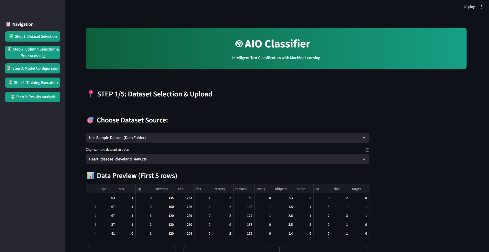
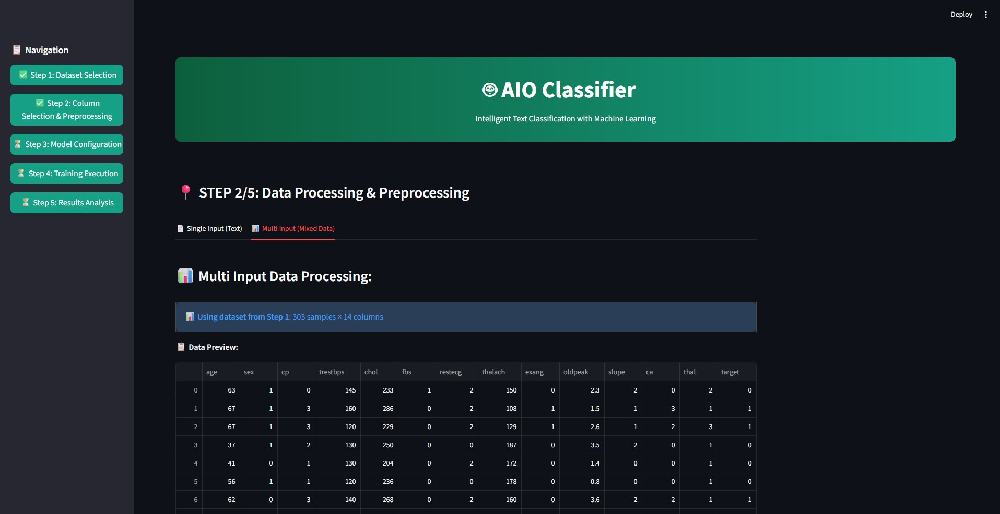
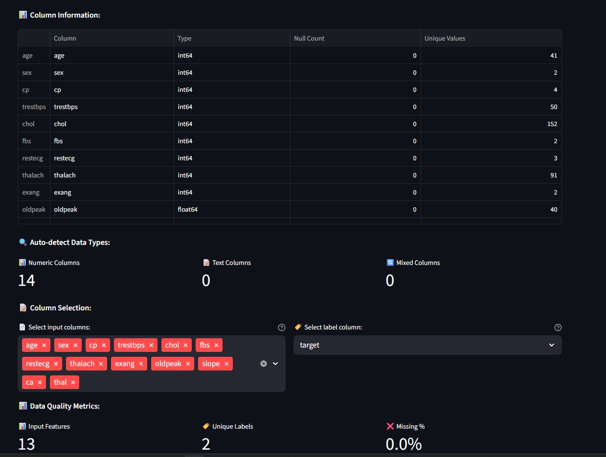
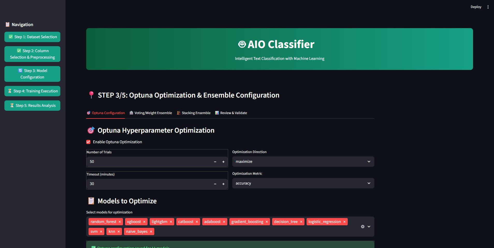
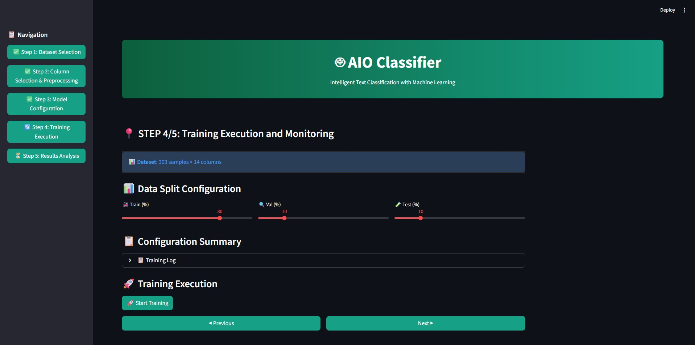
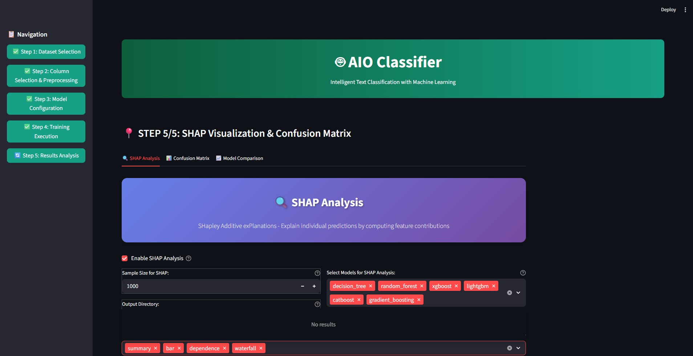
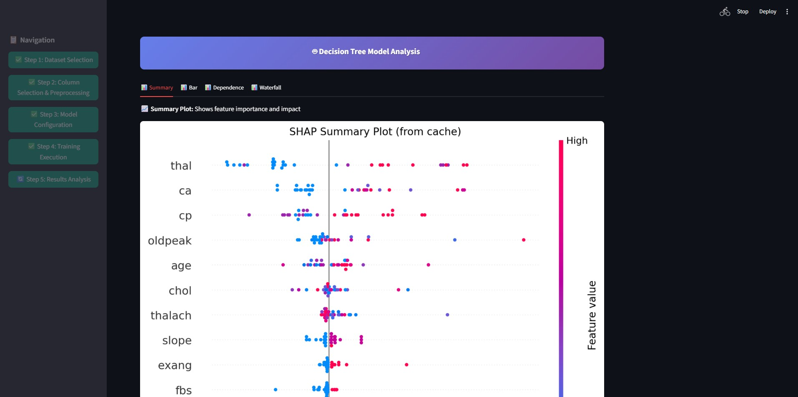
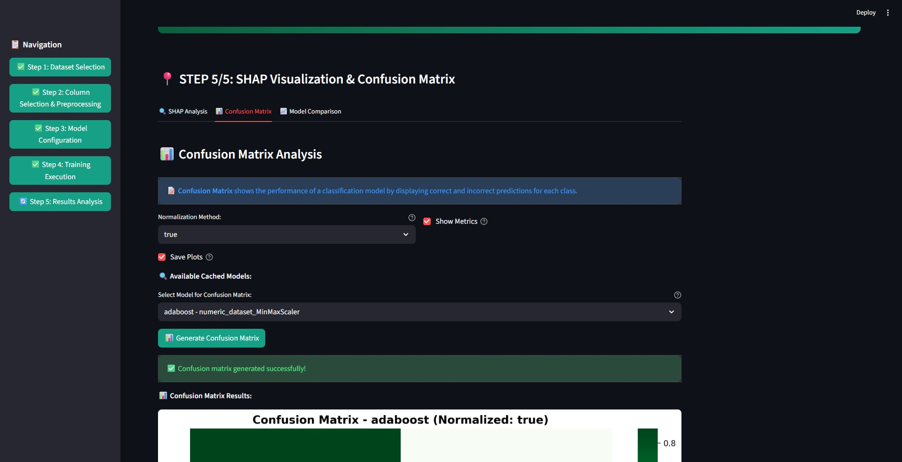

# 📊 AIO Classifier Workflow Screenshots

## 1. Dataset Selection (Step 1/5)

- Giao diện cho phép người dùng chọn tập dữ liệu từ thư mục mẫu hoặc tải lên.
- Ví dụ: Dataset `Heart_disease_cleveland_new.csv` được chọn.
- Hiển thị preview 5 dòng đầu tiên của dữ liệu, gồm các cột: `age, sex, cp, trestbps, chol, fbs, restecg, thalach, exang, oldpeak, slope, ca, thal, target`.

---

## 2. Data Processing & Preprocessing (Step 2/5)

- Cho phép xử lý dữ liệu đầu vào, lựa chọn input features và label column (`target`).
- Hệ thống tự động nhận diện kiểu dữ liệu: 14 cột numeric, không có missing values.
- Có 13 input features và 2 nhãn phân loại (`target`).

---

## 3. Model Configuration & Optimization (Step 3/5)

- Cấu hình huấn luyện mô hình kết hợp với **Optuna** để tối ưu hyperparameters.
- Người dùng có thể chọn số lượng trials (ví dụ: 50) và thời gian tối đa.
- Hỗ trợ nhiều mô hình: `random_forest, xgboost, lightgbm, catboost, adaboost, gradient_boosting, decision_tree, logistic_regression, svm, knn, naive_bayes`.

---

## 4. Training Execution & Monitoring (Step 4/5)

- Cho phép cấu hình chia tập dữ liệu: Train (80%), Validation (10%), Test (10%).
- Sau khi chạy huấn luyện, kết quả hiển thị:
  - ✅ 39 mô hình được train thành công.
  - 🎯 Best Accuracy: **0.9355**
  - ⏱️ Avg Training Time: 3.15s
- Bảng chi tiết: hiển thị các metric (validation_accuracy, test_accuracy, f1_score, precision, recall, training_time) cho từng mô hình.

---

## 5. Results Analysis: SHAP & Confusion Matrix (Step 5/5)
### 5.1 SHAP Analysis

- Hệ thống phân tích SHAP để giải thích ảnh hưởng của từng feature lên kết quả mô hình.
- Các loại plot hỗ trợ: Summary, Bar, Dependence, Waterfall.
- Ví dụ: Với mô hình Decision Tree, các feature quan trọng nhất gồm: `thal, ca, cp, oldpeak, age`.

### 5.2 Confusion Matrix

- Hiển thị Confusion Matrix để đánh giá hiệu quả phân loại.
- Có thể chọn normalization (`true` hoặc `false`).
- Ví dụ: Confusion Matrix normalized cho mô hình `adaboost`.

---
