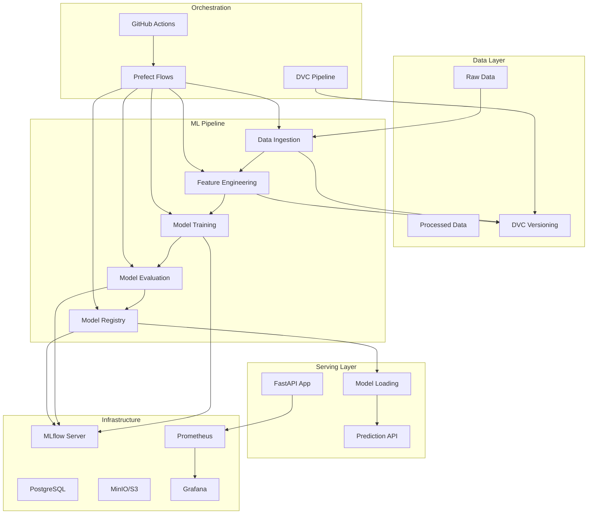

# MLOps Architecture Documentation

## Kiến trúc Tổng quan

Dự án Topic Modeling đã được chuyển đổi thành một hệ thống MLOps production-ready với kiến trúc microservices và best practices.

## Kiến trúc Hệ thống



## Các Thành phần Chính

### 1. Data Management Layer

#### DVC (Data Version Control)
- **Chức năng**: Data versioning và pipeline management
- **Files**: `dvc.yaml`, `params.yaml`, `.dvc/`
- **Storage**: S3/MinIO remote storage
- **Benefits**: 
  - Reproducible data pipelines
  - Data lineage tracking
  - Efficient data storage

#### Data Directory Structure
```
data/
├── raw/                    # Raw data files
├── processed/              # Processed data
├── cache/                 # DVC cache
└── metadata/              # Data metadata
```

### 2. ML Pipeline Layer

#### Training Module (`src/train/`)
- **File**: `src/train/main.py`
- **Chức năng**: 
  - Data loading và preprocessing
  - Model training với MLflow tracking
  - Optuna hyperparameter optimization
  - Model evaluation và metrics logging

#### Feature Engineering (`src/fe/`)
- **Chức năng**: Text preprocessing và feature extraction
- **Integration**: Tích hợp với DVC pipeline

#### Evaluation (`src/eval/`)
- **Chức năng**: Model evaluation và performance metrics
- **Integration**: MLflow metrics logging

### 3. Model Serving Layer

#### FastAPI Application (`src/serve/`)
- **File**: `src/serve/app.py`
- **Endpoints**:
  - `GET /health` - Health check
  - `POST /predict` - Model prediction
  - `GET /metrics` - Prometheus metrics
- **Features**:
  - Model loading từ MLflow Registry
  - Prometheus metrics integration
  - Error handling và logging

### 4. Infrastructure Layer

#### MLflow Server
- **Backend**: PostgreSQL database
- **Artifact Store**: MinIO/S3
- **Features**:
  - Experiment tracking
  - Model registry
  - Model versioning
  - Model deployment

#### Monitoring Stack
- **Prometheus**: Metrics collection
- **Grafana**: Monitoring dashboards
- **Evidently**: Data/model drift detection

#### Database
- **PostgreSQL**: MLflow backend storage
- **MinIO**: S3-compatible object storage

### 5. Orchestration Layer

#### Prefect Flows (`src/prefect_flows.py`)
- **Chức năng**: End-to-end ML pipeline orchestration
- **Features**:
  - Task dependencies
  - Error handling
  - Retry mechanisms
  - Monitoring

#### DVC Pipeline (`dvc.yaml`)
- **Chức năng**: Data pipeline orchestration
- **Stages**: ingest, train, evaluate
- **Dependencies**: Data và parameter dependencies

#### CI/CD Pipeline (`.github/workflows/ci-cd.yml`)
- **Chức năng**: Automated CI/CD
- **Features**:
  - Automated testing
  - Model training
  - Canary deployment
  - Rollback procedures

## Data Flow

### 1. Training Pipeline
```
Raw Data → Data Ingestion → Feature Engineering → Model Training → Model Evaluation → Model Registry
```

### 2. Serving Pipeline
```
Model Registry → Model Loading → FastAPI Serving → Prediction → Metrics Collection
```

### 3. Monitoring Pipeline
```
Application Metrics → Prometheus → Grafana → Alerting
Data Drift → Evidently → Drift Reports → Alerts
```

## Configuration Management

### Environment Variables
- **File**: `.env.example`
- **Variables**:
  - MLflow tracking URI
  - Database connections
  - S3/MinIO credentials
  - Model configuration

### Parameters
- **File**: `params.yaml`
- **Content**: Hyperparameters và pipeline parameters
- **Management**: DVC parameter tracking

### Infrastructure
- **File**: `infra/docker-compose.dev.yml`
- **Services**: PostgreSQL, MinIO, MLflow
- **Management**: Docker Compose

## Security Considerations

### 1. Data Security
- Encrypted data storage
- Access control cho S3/MinIO
- Secure database connections

### 2. Model Security
- Model versioning và integrity
- Secure model serving
- API authentication (có thể thêm)

### 3. Infrastructure Security
- Container security
- Network isolation
- Secret management

## Scalability Considerations

### 1. Horizontal Scaling
- FastAPI app có thể scale horizontally
- MLflow server có thể cluster
- Database có thể replicate

### 2. Resource Management
- GPU resource management
- Memory optimization
- CPU utilization optimization

### 3. Data Pipeline Scaling
- DVC có thể handle large datasets
- Prefect có thể scale workers
- Parallel processing support

## Monitoring và Observability

### 1. Application Metrics
- Request latency
- Error rates
- Throughput
- Resource utilization

### 2. ML Metrics
- Model performance
- Data drift
- Model drift
- Prediction accuracy

### 3. Infrastructure Metrics
- Database performance
- Storage utilization
- Network metrics
- Container health

## Deployment Strategies

### 1. Development
- Local Docker Compose setup
- MLflow UI access
- Direct model serving

### 2. Staging
- Automated CI/CD pipeline
- Canary deployment
- Automated testing

### 3. Production
- Full monitoring stack
- Automated rollback
- High availability setup

## Best Practices Implemented

### 1. Code Organization
- Modular architecture
- Clear separation of concerns
- Consistent naming conventions

### 2. Data Management
- Version control cho data
- Reproducible pipelines
- Data lineage tracking

### 3. Model Management
- Model versioning
- Experiment tracking
- Automated evaluation

### 4. Deployment
- Containerization
- Infrastructure as code
- Automated deployment

### 5. Monitoring
- Comprehensive metrics
- Automated alerting
- Performance monitoring

---
*Architecture documentation created on: 2025-01-14*
*MLOps best practices implemented*
